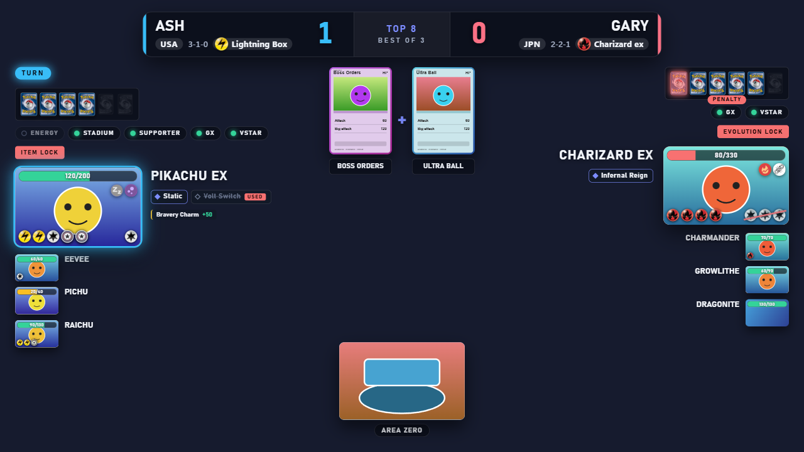
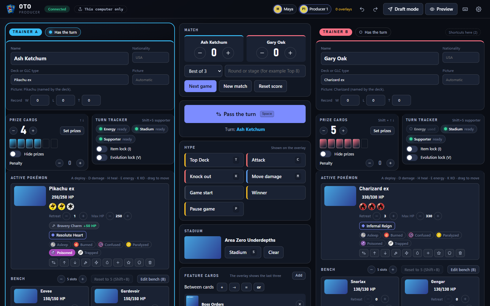
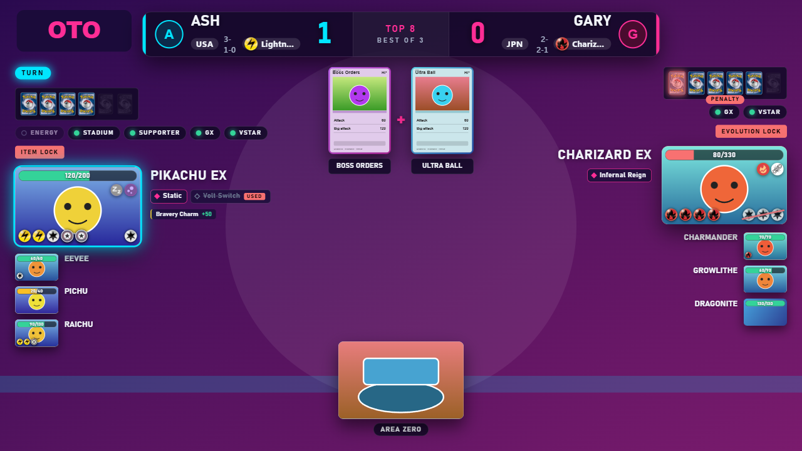

<p align="center">
  
</p>

# OTO: a live overlay for Pokémon TCG streams

[](https://github.com/manucruzleiva/obs-tcg-overlay/actions/workflows/ci.yml)
[](LICENSE)
[](https://github.com/sponsors/manucruzleiva)

**OTO** (OBS TCG Overlay) puts a live scoreboard on your Pokémon TCG stream: prizes, Active and benched Pokémon, HP, tools, energy, the Stadium, the score and the hype announcements, drawn on screen in OBS. A producer runs it all from a control panel on a laptop, tablet or phone, and several producers can work at the same time without stepping on each other.

<p align="center">
  
</p>

> **Status:** early, but complete end to end. You can run a whole match with several producers, a password, your own look and sounds, and an offline card library. Read [Known issues](#known-issues) first.
>
> This is an unofficial fan project. It is not affiliated with The Pokémon Company, Nintendo, Creatures or GAME FREAK ([NOTICE.md](NOTICE.md)).
>
> **Made entirely with AI.** See the [AI disclosure](#ai-disclosure).

## Pick your path

| You are | Start here |
|---------|------------|
| **A streamer, producer or store organizer.** You run matches and do not want to touch code | [For streamers and producers](#for-streamers-and-producers) and the [full guide](docs/USING.md) |
| **An artist or designer.** You want to give a stream, a store or an event its own look | [For artists and designers](#for-artists-and-designers) and the [design guide](docs/DESIGNING.md) |
| **A developer.** You want to run it from source, fix something or build on it | [For developers](#for-developers) and the [developer guide](docs/DEVELOPING.md) |

---

## For streamers and producers

You do not need to be technical. If you can install a program and add a source in OBS, you can use OTO.

### How it works

OTO runs quietly on one computer (usually the streaming PC) and gives you two web pages:

| Page | What it is | Who uses it |
|------|-----------|-------------|
| **Control panel** | Buttons for prizes, damage, turns, knock-outs, announcements and all the settings | The producer(s), in any web browser |
| **Overlay** | The graphics, on a transparent background | OBS, as a Browser Source |

What a producer does in the control panel shows on the overlay at once. Nothing is uploaded anywhere: it all stays on your own network. (Only card data and pictures, and the check for updates, use the internet, and you can [keep the cards on your computer](docs/USING.md#card-library-and-working-offline).)

<p align="center">
  
</p>

### Install it (Windows)

1. Download from the [Releases](https://github.com/manucruzleiva/obs-tcg-overlay/releases) page:
   - **`OTO-Setup-x.y.z.exe`**: installs OTO for your user and keeps itself up to date. **Recommended.**
   - **`OTO-x.y.z-portable.exe`**: runs without installing (a USB stick, say). It does not update itself and opens slowly the first time.
2. Run it. An icon appears in the system tray (near the clock) and the control panel opens.
   - Windows may show a blue *"Windows protected your PC"* screen, because OTO is not code-signed yet ([why](docs/SIGNING.md)). Click **More info, then Run anyway**.
   - If Windows Firewall asks, allow OTO on **Private networks** so your other devices can reach it.
3. Add the overlay to OBS: **+** under *Sources*, choose **Browser**, set the URL to `http://localhost:6767/overlay`, width `1920`, height `1080`, and untick *Shutdown source when not visible*.

That is all. Open the control panel, type the trainers' names and run the match.

### What you can do

- **Run a whole match from the keyboard.** Prizes, damage, heal, energy, evolve and go back a stage, tools and maximum HP, knock outs (several at once), moving damage between Pokémon, abilities, special conditions, Stadium, feature cards for the commentary, pause, undo and redo. Press **`?`** in the control panel for every shortcut.
- **Produce together.** Share a link and other people drive the same match from their own device. Clicks are never counted twice, undo is shared, and a shared **draft mode** lets the team prepare changes and send them to the overlay all at once. The host can rename or remove producers and set a password from the tray icon.
- **Several overlays for one match.** A second (or third) overlay with its own design and options, for a vertical stream next to the horizontal one.
- **Choose what the audience sees.** A switch for every piece of the overlay, banners and full-screen effects for every big moment, and optional sound effects.
- **Work offline.** Keep the Standard, Gym Leader Challenge or Expanded card library and the pictures on your computer.
- **Wear a design.** Install a `.oto` file an artist made, or make your own in the editor.

**Learn more:** [the complete guide for streamers and producers](docs/USING.md) has the keyboard table, every setting and the troubleshooting list.

---

## For artists and designers

A **design** is the look of the overlay: colors, logo, background, avatars, card backs, icons, fonts, sounds, and where every piece sits on the screen. Everything is made in the **Look** tab of Settings, with a canvas that shows the overlay as you change it, and shared as a single `.oto` file.

- **Start from the built-in look.** *Copy of the built-in look* gives you a design with every color and font written out. The same design is in this repository as code, [docs/examples/built-in-look/design.json](docs/examples/built-in-look/design.json), so you can read it, change it and drop it into a folder.
- **A font for each kind of text.** Names, numbers, labels, banner titles, subtitles and small text can each have their own font file, or a list of fonts installed on the machine that shows the overlay.
- **Move and resize every piece** on a zoomable canvas with snapping lines and a grid. A design can be a wide screen (1920 × 1080) or a **tall mobile screen** (1080 × 1920).
- **Reserve spaces** for a camera feed (up to six: rectangle, rounded or oval) and draw your own frame over each.
- **Crop the cards** (just the art, the whole card, or any rectangle), place the HP bar, energy, retreat cost and status icons, choose the picture on the prize cards and how they are laid out.
- **Bring sounds** for any of the moments of a match.
- **Share it.** *Save as .oto* gives a ZIP-based file that carries the design, its sounds and, if you like, your control settings. You can also make one by hand by zipping a folder.

**Learn more:** [the design guide](docs/DESIGNING.md) walks through making a design, and [docs/PACKAGE-FORMAT.md](docs/PACKAGE-FORMAT.md) is the exact file format.

<p align="center">
  
</p>
<p align="center">
  
</p>

---

## For developers

OTO is a Node.js server (Express and Socket.io) with a plain HTML, CSS and JavaScript control panel and overlay, **no build step** for the web parts, wrapped in an Electron tray app for Windows.

```bash
git clone https://github.com/manucruzleiva/obs-tcg-overlay.git
cd obs-tcg-overlay
npm install            # also downloads Electron (~100 MB); add --ignore-scripts to skip it
npm start              # http://localhost:6767/control
```

| Command | What it does |
|---------|--------------|
| `npm start` | Run the server only |
| `npm run electron:dev` | The server plus the Electron window |
| `npm test` | Server and logic tests: they boot the real server and drive it over HTTP and socket.io |
| `npm run test:ui` | The control panel, settings and overlay in a real browser (Chrome or Edge) |
| `npm run test:desktop` | The desktop app end to end |
| `npm run dist` | Build the Windows installer and the portable `.exe` into `dist/` |

- **One authoritative game state** with a `revision`. Every change goes through `Session.finish()`, and an action that touches something another producer just changed is refused instead of applied twice.
- Shared **catalog modules** (UMD, used by the server and the browser) keep the options, designs and card rules in one place.
- Everything is tested: about a thousand automated tests over the server, a real browser and the Electron app. Pull requests are welcome.

**Learn more:** [the developer guide](docs/DEVELOPING.md) covers the architecture, configuration, the security model, the REST and socket API, the tests, releases and code signing. To contribute, read [CONTRIBUTING.md](CONTRIBUTING.md).

---

## Known issues

These are open for contributions:

- **OTO is not code-signed**, so Windows shows a SmartScreen warning on first run. The release workflow already signs when it is given a certificate ([docs/SIGNING.md](docs/SIGNING.md)).
- **Only Windows installers are built.** The server runs anywhere Node 22+ does, but macOS and Linux desktop builds are untested.
- **The card service can be slow or down.** OTO retries and resumes downloads, but the first library download needs the service to be reachable.
- The overlay has not been tried on every OBS version. It is written for the Chromium that ships with OBS, so it avoids newer browser features.
- The cards are not understood by the overlay yet: a producer types the numbers (see the roadmap in [docs/USING.md](docs/USING.md#roadmap)).

## Support the project

OTO is free and made in spare time. If it helps your streams, you can sponsor the maintainer on [GitHub Sponsors](https://github.com/sponsors/manucruzleiva). Bug reports, ideas, designs and pull requests help just as much.

## AI disclosure

This project was made **entirely with AI**. The code, tests, documentation and build scripts were written by AI coding assistants ([Claude](https://www.anthropic.com/claude) through Claude Code), working from requirements and decisions given by the maintainer, [@manucruzleiva](https://github.com/manucruzleiva). Commits made that way say so with a `Co-Authored-By` line.

We say this plainly so you can decide for yourself. If software made with AI is not something you want to use or contribute to, that is a fair choice and no hard feelings. If you do use it, treat it like any early-stage project: it has a large automated test suite, but no independent audit, so read the [known issues](#known-issues) and the [security model](docs/DEVELOPING.md#security-model) first.

Contributions are welcome whether you write them by hand or with AI help. Either way you are responsible for what you submit, and it must pass the same checks ([CONTRIBUTING.md](CONTRIBUTING.md)).

## License

[MIT](LICENSE). Third-party notices and the trademark disclaimer are in [NOTICE.md](NOTICE.md).

## Acknowledgments

[Pokémon TCG API](https://pokemontcg.io/), [TCGdex](https://tcgdex.dev/), [PokeAPI](https://pokeapi.co/) and [Limitless TCG](https://limitlesstcg.com/) for the data that makes the cards and decks easy to pick; [OBS Studio](https://obsproject.com/); [Electron](https://www.electronjs.org/) and [Socket.io](https://socket.io/).
