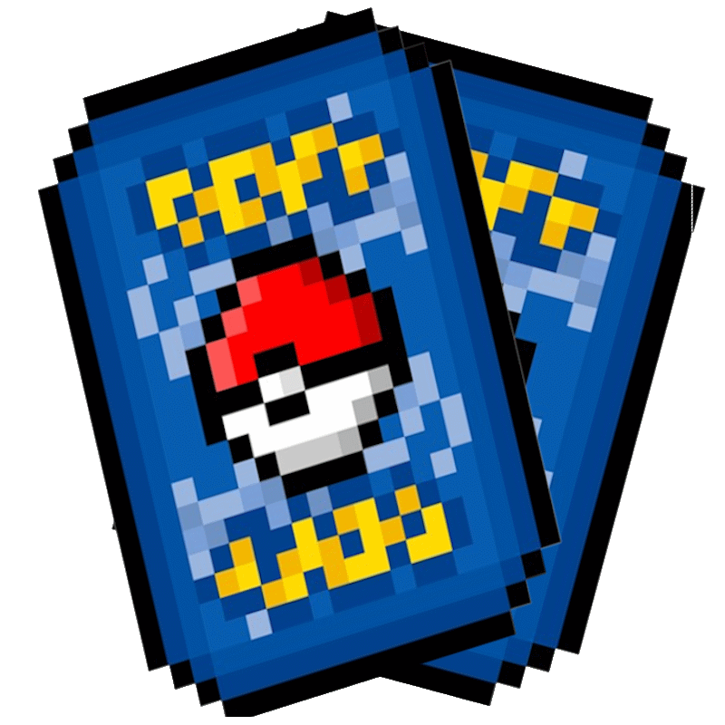
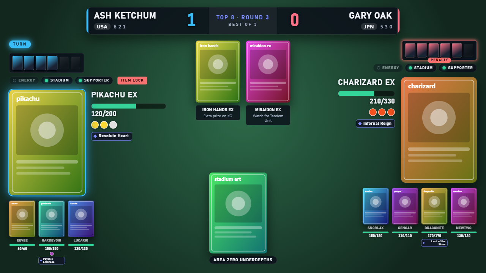
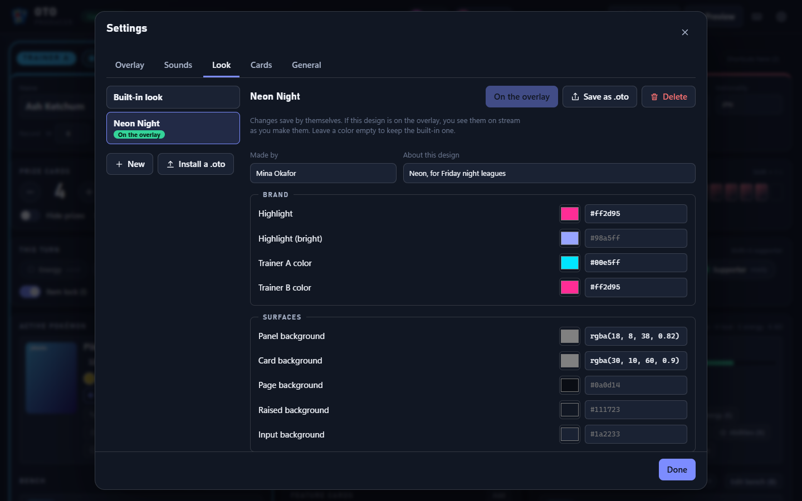

<p align="center">
  
</p>

# OTO: a live overlay for Pokémon TCG streams

[](https://github.com/manucruzleiva/obs-tcg-overlay/actions/workflows/ci.yml)
[](LICENSE)

**OTO** (OBS TCG Overlay) puts a live scoreboard on your Pokémon TCG stream. Prizes, active and benched Pokémon, HP, the stadium, the match score and the hype announcements show up on screen in OBS, while a producer runs everything from a control panel on a laptop, tablet or phone. Several producers can work at the same time without stepping on each other.

<p align="center">
  
</p>

> **Status:** early-stage but complete end to end: you can run a whole match, with several producers, a password, your own look and sounds, and an offline card library. Read [Known issues](#known-issues) first.
>
> This is an unofficial fan project, not affiliated with The Pokémon Company, Nintendo, Creatures or GAME FREAK. See [NOTICE.md](NOTICE.md).
>
> **AI disclosure:** this project was built entirely with AI. See [AI disclosure](#ai-disclosure).

**Jump to:** [Who it's for](#who-its-for) · [Get started](#get-started-windows) · [Run a match](#run-a-match) · [Producing together](#producing-together) · [Show and hide](#show-and-hide-anything) · [Sounds](#sound-effects) · [Designs and .oto packages](#designs-and-oto-packages) · [Card library](#card-library-and-working-offline) · [Installing and updating](#installing-repairing-and-updating) · [Troubleshooting](#troubleshooting) · [For developers](#for-developers)

---

## Who it's for

- **Local game stores and leagues** that stream or record tournaments, League Challenges and casual nights, and want a clean, professional look without a production crew.
- **Content creators, casters and tournament organizers** who cover Pokémon TCG matches and need an overlay that someone else can drive while they commentate.
- **Artists and designers** who give a stream, store or event its own identity: colors, logos, backgrounds, avatars, card backs, fonts and even sound effects, shared as a single `.oto` file. See [Designs and .oto packages](#designs-and-oto-packages).

You do not need to be technical. If you can install a program and add a source in OBS, you can use this.

## How it works, in plain words

OTO runs quietly on one computer (usually the streaming PC) and gives you two web pages:

| Page | What it is | Who uses it |
|------|-----------|-------------|
| **Control panel** | Buttons for prizes, damage, turn, knock-outs, announcements, and all the settings | The producer(s), in any web browser |
| **Overlay** | The graphics themselves, on a transparent background | OBS, as a Browser Source |

Whatever a producer does in the control panel appears on the overlay instantly. Nothing is uploaded anywhere: it all stays on your own network. (The only things that use the internet are looking up card data and pictures, which you can [keep on your computer](#card-library-and-working-offline), and checking for updates.)

<p align="center">
  
</p>

## Get started (Windows)

1. **Download** from the [Releases](https://github.com/manucruzleiva/obs-tcg-overlay/releases) page (if there is no release yet, see [For developers](#for-developers) to build it):
   - **`OTO-Setup-x.y.z.exe`** installs OTO for your user account and keeps itself up to date. **Recommended.**
   - **`OTO-x.y.z-portable.exe`** runs without installing, for example from a USB stick. It does not update itself, and it unpacks itself every time it starts, so it opens more slowly than the installed version (up to a minute the first time).
2. **Run it.** A small icon appears in the system tray (near the clock) and the control panel opens.
   - Windows may show a blue *"Windows protected your PC"* screen the first time, because the app is not code-signed yet. Click **More info, then Run anyway**.
   - Windows Firewall may ask whether to allow OTO on your network. Choose **Private networks** so other devices can reach it.
3. **Add the overlay to OBS:**
   1. In OBS, click **+** under *Sources* and choose **Browser**.
   2. Set **URL** to `http://localhost:6767/overlay`
   3. Set **Width** to `1920` and **Height** to `1080`.
   4. Untick **Shutdown source when not visible**, so the overlay keeps its state when you switch scenes.
   5. Optional, for [sound effects](#sound-effects): tick **Control audio via OBS**.
4. **Run your match** from the control panel (next section).

If OBS runs on a *different* computer than OTO, use OTO's computer's network address instead of `localhost` (see [Producing together](#producing-together)).

## Run a match

Set the trainers' names and nationalities, pick their Pokémon, and keep score as the game goes. Everything has a button and, for the things you do all game, a key. Press **`?`** in the control panel to see the list.

| Key | Action |
|-----|--------|
| `Space` | Pass the turn |
| `1` / `2` | The keys below apply to Trainer A / Trainer B (they follow whoever has the turn on their own) |
| `↑` / `↓` | Trainer A takes / gives back a prize card. Add `Shift` for Trainer B |
| `A` | Deploy a new Active Pokémon (search for a card, or bring one up from the bench) |
| `B` | Edit the bench |
| `D` | Damage: choose the Pokémon (one or several) and the amount |
| `H` | Heal |
| `E` | Attach energy: counts as the turn's attachment, or switch that off for a special attachment |
| `K` | Knock out: pick the Pokémon and how many prizes the opponent takes; announces it, clears the slot and offers the next Active |
| `S` | Put a Stadium in play |
| `Shift` + `S` | Supporter played this turn |
| `X` | Ability tokens: mark a Pokémon's ability used (once per turn, or once per game) |
| `I` / `V` | Item lock / Evolution lock on or off |
| `C` | Announce an attack (name and damage, and apply the damage if you like) |
| `T` / `P` | Top Deck / Pass Turn announcements |
| `Ctrl` + `Z` | Undo |
| `Ctrl` + `Y` (or `Ctrl` + `Shift` + `Z`) | Redo |
| `Ctrl` + `Enter` | Send your draft to the overlay (see [Producing together](#producing-together)) |
| `Esc` | Close a dialog |

Shortcuts are ignored while you are typing in a text box.

**More that helps**

- **Ability tokens** show on each Pokémon, ready or used. A once-per-turn ability becomes ready again when its trainer's turn begins.
- **Feature cards** let you show something to the audience during commentary.
- **Preview** shows the overlay inside the control panel.
- **Autosave:** if OTO closes unexpectedly, your match is restored when it reopens.
- **Match history:** every change is recorded in the activity feed with the name of the person who made it.

## Producing together

Often the person running the game is not the person at the streaming PC. They can use their own laptop, tablet or phone on **the same network** (the same Wi-Fi or router).

**Sharing the link**

- At the top of the control panel you will see a link such as `http://192.168.1.20:6767/control`. Click it to copy, then send it to the other producer.
- Or right-click the tray icon and choose **Copy Control Link for Other Devices**. Settings, then General, lists every address too.
- The same address works for the overlay if OBS runs on another computer: replace `/control` with `/overlay`.

**Working at the same time is safe.** If two people open the control panel:

- **Their pages stay in sync**, live. You see who else is connected at the top.
- **A click is never counted twice.** If someone changes the same thing a moment before you click, your click is refused with a short message ("Maya just changed this") so a prize card is not taken twice. Look at the new value, and click again if you still need to.
- **Undo and redo are shared** (`Ctrl+Z`, `Ctrl+Y`). The activity feed says who did what.
- Only the overlay and control panel see the state; there is nothing to merge afterwards.

**Edit & send drafts.** Click **Edit & send** to change things privately: your page shows your edits, the overlay and the other producers do not see them. When you are ready, **Send to overlay** (or `Ctrl+Enter`) applies them all at once as a single step you can undo. If another producer changed the same things meanwhile, you are shown what clashes and can send only the rest, send everything anyway, or keep editing.

**Password.** Settings, then General, lets you set a password for the control panel. It can be any text, with no rules. Everyone has to sign in once; the overlay for OBS never needs it. The password is stored scrambled, never as typed. Wrong guesses are slowed down.

- To set it before the app starts, use the `OTO_PASSWORD` environment variable (it takes priority and cannot be changed in the app).
- **Forgot it?** Quit OTO and start it once with the environment variable `OTO_RESET_PASSWORD=1`; the password is removed and you can choose a new one. (Anyone who can start OTO on the computer can already read its files, so this gives nothing away.)

**Good to know**

- Without a password, anyone on the network who has the link can control your overlay. Share it only with people you trust, avoid open public Wi-Fi, and set a password on shared networks. To accept only the local computer, start with `HOST=127.0.0.1` (see [Configuration](#configuration)).
- Guest Wi-Fi networks often stop devices talking to each other. If the link does not open, see [Troubleshooting](#troubleshooting).

## Show and hide anything

Settings, then **Overlay**, has a switch for every element: the scoreboard, match score, round label, names, nationality, tournament record, prize cards, energy and stadium counters, lock badges, the Active Pokémon and bench, Pokémon names, HP bars, attached energy, ability tokens, the stadium, feature cards, banners and full-screen animations. Two presets help: **Show everything**, and **Minimal** (score, names, the Active Pokémon and HP).

The same tab has a table of announcements (start of game, victory, Top Deck, attack, pass turn, knock out) where each can show a **banner**, a **full-screen effect**, or both, and sets **how long** banners and effects stay on screen (1 to 30 seconds each). A new announcement always replaces the one still showing, so the screen never fills up during a fast turn. A **Picture** section sets the overlay's opacity and whether it scales to fit the browser source.

## Sound effects

Settings, then **Sounds**. Sound effects play from the overlay, so OBS picks them up as browser source audio. They are **off until you switch them on**, because a surprise noise on a live stream is worse than none.

- Each moment has its own switch and volume: deploying, benching, damage, heal, knock out, passing the turn, attaching energy, an ability, a stadium, taking a prize, winning a game or the match, an attack, a Top Deck.
- Every moment has a built-in sound. Click **Use my own** to give it your own MP3, WAV, OGG, M4A or WebM file (up to 1.5 MB), or let a [design](#designs-and-oto-packages) bring its own. **Test** plays any of them.
- Your own sound beats the design's, which beats the built-in one.
- To put sounds on their own audio track in OBS, tick **Control audio via OBS** on the browser source.

## Designs and `.oto` packages

The **Look** tab is where artists and organizers give OTO its own identity. A **design** holds:

- **Colors:** panels, text, highlight, trainer colors, warning and danger colors, corner roundness and animation speed.
- **Pictures:** logo, background, trainer A and B avatars, prize card back, card back, and an energy icon strip.
- **A font** for names, numbers and announcements.
- **Sounds** for any of the moments above.
- A **name, author and description**, shown when someone installs it.

Changes save by themselves, and if the design is on the overlay you see them on stream as you make them.

<p align="center">
  
</p>
<p align="center">
  
</p>

### Sharing a design: the `.oto` file

A **`.oto` file** puts a design, its sounds **and your control settings** in one compressed file:

- **Design:** colors, pictures, font and sounds.
- **Control settings:** what the overlay shows or hides, how long announcements stay, which announcements and sounds are on, and sound volumes. (Never your card API key or password.)

It is an ordinary ZIP file with another name, so artists can make one by zipping a folder, and anyone can open one to see what is inside. See the [package format](docs/PACKAGE-FORMAT.md).

- **Save one:** Look tab, **Save as .oto** (a design, with or without your settings), or Settings, General, **Save my setup as .oto**.
- **Install one:** Look tab, **Install a .oto**, or **drop the file on the control panel**, or **double-click it** with the desktop app. You are shown what is inside first, and choose whether to install the design, put it on the overlay, and apply its control settings. If you already have a design with that name, you can keep both or replace it. Applying control settings can be undone with `Ctrl+Z`.

Packages are checked as they are opened: a `.oto` can only ever hold pictures, a font, sounds and settings, never code, and a damaged or tricky file is refused without installing any of it. Designs work offline, because everything they use is inside them.

## Card library and working offline

Searching for cards normally asks an online service, which can be slow, rate-limited, or unreachable at a venue with poor Wi-Fi. Settings, then **Cards**, lets you keep a copy of the cards you need on your computer:

| Library | What is in it |
|---------|---------------|
| **Standard** | The current rotation (regulation marks H, I and J) and basic Energy |
| **Gym Leader Challenge** | Every Expanded-legal card except Pokémon with a rule box (ex, V, VMAX, VSTAR, GX and the like) |
| **Expanded** | Every Expanded-legal card. A big download (around 15,000 cards): you are asked first |

- **Download** runs in the background with a progress bar, and **you can keep producing** while it does. If the card service fails halfway, which it sometimes does, it carries on from where it stopped. Stop it any time.
- Pick one library to **search**. Searching it is instant and works with no internet, and a card it does not have is looked up online. Gym Leader Challenge is built from Expanded without downloading again if you already have that.
- **Card pictures** are saved on your computer the first time they are shown, so a card shown once still shows offline. You can also **save the pictures ahead of time** (small ones for the search, or the full-size art the overlay shows), and delete them again.
- A free API key from [pokemontcg.io](https://pokemontcg.io/) raises the request limits. Paste it in the same tab.

## Installing, repairing and updating

**The installer** installs OTO for your user account. If you run it again while OTO is installed, it first asks what you want:

- **Repair:** put the program files back (and update them if the installer is newer). Your matches, designs, sounds and settings stay as they are.
- **Reinstall from scratch:** as Repair, and OTO starts with empty data. What you had is **moved into a backup folder, not deleted**, so you can put it back.
- **Uninstall:** remove OTO. Your data stays on disk.

If OTO is running, the installer **closes it for you the polite way**: OTO is asked to save the match and quit, and is only ended by force if it does not finish within about fifteen seconds. (For scripts: `OTO-Setup.exe /S` repairs silently, and `OTO-Setup.exe /S --mode=reinstall` starts fresh.)

**Updates.** The installed version checks GitHub for a newer release shortly after it starts and every few hours afterwards. A new version downloads in the background and is **never installed while you are live**: it applies the next time you quit, or at once if you choose **Restart to update** from the tray menu. The portable version does not update itself. Set `OBS_TCG_DISABLE_UPDATES=1` to turn the check off. The only thing sent is the request to GitHub for release information.

**The tray icon** (near the clock) keeps OTO running when you close the window: Settings, General, **Keep running in the tray when the window is closed**. Right-click it for:

- Open the control panel or the overlay, and copy the control link for other devices
- **Troubleshooting:** restart the service, open the data or logs folder, or **Back up and start fresh** (moves everything OTO saved into a backup folder and restarts empty)
- Update actions and **Quit**

**Where is my data?** In `%APPDATA%\obs-tcg-overlay\`: the `data` folder holds the match database, designs, sounds, card libraries and pictures, and `logs` holds the logs. Set `OTO_DATA_DIR` to keep everything in a folder of your choice instead (a USB stick, say).

## Troubleshooting

**The overlay is blank in OBS.** Make sure OTO is running (look for the tray icon), the URL is exactly `http://localhost:6767/overlay`, and open that address in a normal browser to check. Another program may be using port 6767.

**The producer's device can't open the link.**
- Both devices must be on the same network. Guest Wi-Fi often blocks devices from talking to each other.
- Allow OTO through Windows Firewall for **Private networks** (Windows Security, Firewall & network protection, *Allow an app through firewall*).
- Check the link starts with this computer's current address. It can change if the router restarts; the top of the control panel always shows the current one.
- If you started OTO with `HOST=127.0.0.1`, it only accepts connections from the same computer.

**There is no sound.** Sound effects are off until you switch them on (Settings, Sounds). In OBS, the browser source must not be muted, and tick **Control audio via OBS** if you want them on their own track. Use **Test** next to a sound to hear it from the control panel.

**Card search shows nothing.** Searching online needs an internet connection and the card service, which is sometimes slow or down. Keep a [card library](#card-library-and-working-offline) to be independent of it.

**Windows warns me when I run it.** OTO is not code-signed yet, so SmartScreen asks for confirmation. Choose **More info, then Run anyway**.

**I forgot the password.** See [Producing together](#producing-together).

**Something is badly wrong.** Tray, **Troubleshooting**, **Back up and start fresh**, or run the installer again and choose **Repair**.

## Roadmap

These are plans, not promises. Ideas and pull requests are welcome (see [Contributing](#contributing)).

### Version 2: the overlay understands the cards

Today the producer types every number in by hand. Version 2 teaches the overlay what the cards in play actually do, so the board keeps itself up to date. It also adds a layout for players who record their own matches.

- **Card logic.** When a card changes the numbers on the table, the overlay applies it automatically: a Pokémon Tool that adds HP raises that Pokémon's maximum HP while it is attached; a Stadium that changes retreat cost changes it on the overlay. Anything the automation gets wrong can be corrected by hand, and automatic changes show in the activity feed. (The offline card library is the groundwork for this.)
- **Discard pile display** for each trainer, hideable like every other element.
- **Card counters:** cards **in hand, in the deck and in the discard pile** for each trainer.
- **Vertical overlay for player POV recordings.** A portrait (9:16) version for players who record their own matches, for example for short-form video.

---

## For developers

### Architecture

```
┌──────────────┐   Socket.io    ┌──────────────────────────────┐   Socket.io    ┌──────────────┐
│ Control panel│ ─────────────▶ │ Node.js server               │ ─────────────▶ │   Overlay    │
│ (any browser)│  action:*      │ Express + Socket.io          │  state:update  │ (OBS browser │
└──────────────┘ ◀───────────── │  ├ one authoritative state   │  announce, sfx │   source)    │
        ▲        presence,      │  ├ designs, sounds, packages │                └──────────────┘
        │        activity,      │  ├ card library + pictures   │
        │        drafts         │  ├ SQLite (sql.js) file      │──▶ pokemontcg.io (cards)
   password gate                └──────────────────────────────┘
        Electron wraps the server in a tray app (installer and portable builds)
```

- The server owns **one game state** with a `revision`. Clients send `action:*` events carrying the revision they last saw; the server applies the action, records it (undo, activity, conflict detection) and broadcasts the new state. Every change goes through `Session.finish()`.
- **Conflicts.** An action declares which parts of the state it touches. If another producer changed an overlapping part since the sender's revision, the action is refused (`action:rejected`, reason `conflict`) rather than applied twice. Absolute actions ("set the name to X") are last-writer-wins.
- **Drafts** fork the state per producer, queue the actions, and replay them atomically on send.
- **Announcements and sounds are events, not state:** `announce` and `sfx` fire once, so a reconnecting overlay never replays them.
- The control panel and overlay are plain HTML, CSS and JavaScript (ES modules in the control panel) with **no build step**. The overlay targets the Chromium that ships with OBS, so it avoids newer CSS and JavaScript.

### Run from source

You need [Node.js](https://nodejs.org/) 22 or newer.

```bash
git clone https://github.com/manucruzleiva/obs-tcg-overlay.git
cd obs-tcg-overlay
npm install            # also downloads Electron (~100 MB); add --ignore-scripts to skip it
npm start              # http://localhost:6767/control
```

| Command | What it does |
|---------|--------------|
| `npm start` | Run the server only |
| `npm run electron` | Run the desktop (tray) app from source |
| `npm run electron:dev` | Server plus Electron window |
| `npm test` | Server and logic tests: boots the real server and drives it over HTTP and socket.io (a few hundred tests, about a minute) |
| `npm run test:ui` | The control panel and settings in a real browser (needs Chrome or Edge; set `BROWSER_PATH` to use another) |
| `npm run test:desktop` | The desktop app end to end: opening a `.oto`, `--quit`, the fresh-start backup (needs the Electron binary) |
| `npm run pack` | Build an unpacked desktop app into `dist/` |
| `npm run dist` | Build the Windows installer and portable `.exe` into `dist/` |

Releases are built and published by GitHub Actions when a version tag is pushed; see [CONTRIBUTING.md](CONTRIBUTING.md#releasing-maintainers).

### Configuration

Environment variables:

| Variable | Default | Purpose |
|----------|---------|---------|
| `PORT` | `6767` | HTTP and WebSocket port |
| `HOST` | `0.0.0.0` | Interface to bind. Use `127.0.0.1` to accept only local connections |
| `OTO_PASSWORD` | unset | Password for the control panel (wins over one set in the app) |
| `OTO_RESET_PASSWORD` | unset | Set to `1` for one start to remove a forgotten password |
| `DB_PATH` | `data/overlay.sqlite` | SQLite database file. Designs, sounds, card libraries and pictures are kept in folders beside it |
| `LOG_DIR` | `logs/` | Where log files are written |
| `LOG_LEVEL` | `info` | Winston log level |
| `OTO_DATA_DIR` | `%APPDATA%\obs-tcg-overlay` | Desktop app: keep all its data in this folder |
| `OTO_PORT` | `6767` | Desktop app: use another port (to run a second copy) |
| `OBS_TCG_DISABLE_UPDATES` | unset | Set to `1` to disable update checks in the desktop app |
| `POKEMONTCG_API_URL` | `https://api.pokemontcg.io/v2` | Another card API server (the tests use a local mock) |
| `OTO_IMAGE_BASE` | `https://images.pokemontcg.io` | Where card pictures are fetched from |
| `OTO_SCRYDEX_IMAGE_BASE` | `https://images.scrydex.com` | Where the card pictures of the newest sets are fetched from |

### Security model

By default OTO is built for a trusted local network.

- **Password (optional).** Scrypt-hashed, in a signed cookie bound to the current password, with a login throttle. Unsafe HTTP requests and socket handshakes that name another site as their origin are refused, so a web page cannot drive your overlay. Pages and API calls are redirected to a sign-in page, or answer `401`. The overlay, its files and card pictures stay open for OBS.
- **No password set:** anyone who can reach the port can drive the overlay. Bind to `127.0.0.1` on untrusted networks, set a password, and never expose the port to the internet.
- **`.oto` packages and designs** are untrusted input: strict ZIP parsing (name checks, declared-size enforcement, checksums, a cap on what unpacks), content sniffing, SVGs with scripts or links refused, no web addresses in designs, and design files served with a restrictive content security policy.
- Security headers (CSP, `nosniff`) via Helmet. See [SECURITY.md](SECURITY.md) to report a vulnerability.

### Project layout

```
├── src/
│   ├── server.js            # Express + Socket.io wiring, password gate, pictures route
│   ├── session.js           # live actions, conflicts, undo/redo, drafts, presence
│   ├── actions.js           # every action: what it touches, what it does, how it is described
│   ├── api/routes.js        # REST routes
│   ├── db/database.js       # SQLite via sql.js (persisted to a file)
│   └── services/
│       ├── gamestate.js     # match state and its mutations
│       ├── announcements.js # toasts and full-screen effects
│       ├── collab.js        # change log, undo/redo stacks, activity
│       ├── auth.js          # the optional password and sessions
│       ├── themes.js        # designs: folders of files
│       ├── sounds.js        # the producer's own sounds
│       ├── package.js, zip.js  # .oto packages and the ZIP reader/writer
│       ├── catalog.js, images.js, pokemon-tcg.js, cache.js  # card library, pictures, card API
│       └── network.js       # LAN addresses for the share link
├── public/
│   ├── control/, js/control/ # control panel (ES modules)
│   ├── overlay/, js/overlay.js
│   ├── login/
│   └── css/, js/            # styles and the shared catalogs (display, sounds, themes, sfx)
├── electron/                # desktop wrapper: main process, preload, updater
├── installer/installer.nsh  # Windows installer: graceful close, repair/reinstall page
├── test/                    # server and logic tests (node:test)
├── test-ui/                 # browser tests (Playwright driving Chrome or Edge)
├── test-desktop/            # Electron end-to-end tests
├── test-support/            # the test harness and sample files
├── docs/                    # the .oto package format, screenshots
└── logo.ico, logo.gif       # app icon and project logo
```

### Designs and `.oto` in the code

A design is a **folder** under the data folder: `themes/<name>/design.json` plus `images/`, `fonts/` and `sounds/`. The overlay asks `GET /api/theme` for the design on air and receives colors plus an address for each file; the server serves only the files that design holds. A `.oto` is that folder zipped, with a `manifest.json` and a `controls.json` for the control settings. The format, limits and safety rules are in [docs/PACKAGE-FORMAT.md](docs/PACKAGE-FORMAT.md). Designs saved by earlier versions (one JSON file with the pictures inside) are converted automatically.

### REST API

Open (no password needed): `GET /api/health`, `GET /api/auth/status`, `POST /api/login`, `POST /api/logout`, `GET /api/theme` (the design on air), `GET /api/theme/assets/:folder/:file`, `GET /api/sounds`, `GET /api/sounds/:cue`, `GET /img/:set/:file` (card pictures, saved on first use).

Behind the password:

| Method and path | Description |
|-----------------|-------------|
| `GET /api/state`, `/state/trainerA`, `/state/trainerB`, `/state/match` | The match state, or parts of it |
| `GET /api/settings`, `POST /api/settings` | Read or update settings |
| `POST /api/auth/password` | Set or remove the password |
| `GET /api/cards/search?q=&supertype=&subtype=&rarity=&set=&evolvesFrom=&page=` | Search cards (the library first, then online) |
| `GET /api/cards/:id`, `GET /api/evolution/search` | Card details, evolution search |
| `GET /api/favorites`, `POST /api/favorites/:id` | List or toggle favorites |
| `GET /api/matches` | Finished matches |
| `GET /api/cache/stats`, `POST /api/cache/clear` | Remembered searches |
| `GET /api/config/export`, `POST /api/config/import` | The match and settings as JSON (the API key is never exported) |
| `GET /api/network` | Addresses the control panel and overlay can be reached on |
| `GET /api/catalog`, `POST /api/catalog/:library/download`, `POST /api/catalog/cancel`, `PUT /api/catalog/active`, `DELETE /api/catalog/:library` | The card libraries |
| `POST /api/catalog/pictures`, `DELETE /api/catalog/pictures` | Save or delete card pictures |
| `GET/PUT/DELETE /api/themes[/:name]`, `PUT/DELETE /api/themes/:name/images/:slot`, `/font`, `/sounds/:cue`, `GET /api/themes/:name/assets/...`, `POST /api/theme/active` | Designs and their files |
| `PUT/DELETE /api/sounds/:cue` | The producer's own sounds |
| `GET /api/packages/export`, `POST /api/packages/inspect`, `POST /api/packages/install` | `.oto` packages |

### Socket.io

- **Server to client:** `state:full` (on connect), `state:update` (after every change), `announce`, `sfx`, `presence`, `you`, `activity`, `activity:history`, `action:applied`, `action:rejected`, `draft:state`, `draft:sent`, `draft:conflicts`, `theme:changed`, `sounds:changed`, `catalog:progress`.
- **Client to server:** `action:trainerA`, `action:trainerB`, `action:match`, `action:toast`, `action:card`, `action:settings`, `action:reset`, `action:undo`, `action:redo`, `draft:start`, `draft:send`, `draft:discard`, `presence:rename`. Each action carries `{ action, ...params, meta: { baseRevision, seq } }`. The handlers live in [src/actions.js](src/actions.js).

### Tests

`npm test` runs against the real server with a throwaway database and a mock card API ([test-support/harness.js](test-support/harness.js)): game logic, every action, multi-producer conflicts and drafts, the password, designs, sounds, `.oto` packages, the card library, and the REST surface. `npm run test:ui` drives the control panel and settings in a real browser (keyboard shortcuts, dialogs, drafts, two producers, designs, packages, the library). `npm run test:desktop` runs the Electron app itself. Scratch folders go in `.local/` (git-ignored).

### Contributing

Bug reports, ideas and pull requests are welcome. Start with [CONTRIBUTING.md](CONTRIBUTING.md). Changes come in through pull requests.

## Known issues

These are open for contributions:

- **OTO is not code-signed**, so Windows shows a SmartScreen warning on first run.
- **Only Windows installers are built.** The server runs anywhere Node 22+ does, but macOS and Linux desktop builds are untested.
- **Nationalities show as a text code** (USA, JPN); no flag pictures are bundled.
- **The card service can be slow or down.** OTO retries and resumes downloads, but the first library download needs the service to be reachable.
- The overlay has not been tried on every OBS version; it is written for the Chromium that ships with OBS, so it avoids newer browser features.
- The Version 2 items above are not built yet.

## AI disclosure

This project was made **entirely with AI**. The code, tests, documentation and build scripts were written by AI coding assistants ([Claude](https://www.anthropic.com/claude) through Claude Code), working from requirements and decisions given by the maintainer, [@manucruzleiva](https://github.com/manucruzleiva). Commits made that way say so with a `Co-Authored-By` line.

We say this plainly so you can decide for yourself. If software made with AI is not something you want to use or contribute to, that is a fair choice and no hard feelings. If you do use it, treat it like any early-stage project: it has a large automated test suite, but it has had no independent audit, so read the [known issues](#known-issues) and the [security model](#security-model) first.

Contributions are welcome whether you write them by hand or with AI help. Either way, you are responsible for what you submit and it must pass the same checks (see [CONTRIBUTING.md](CONTRIBUTING.md)).

## License

[MIT](LICENSE). Third-party notices and the trademark disclaimer are in [NOTICE.md](NOTICE.md).

## Acknowledgments

- [Pokémon TCG API](https://pokemontcg.io/) for card data
- [OBS Studio](https://obsproject.com/)
- [Electron](https://www.electronjs.org/) and [Socket.io](https://socket.io/)
